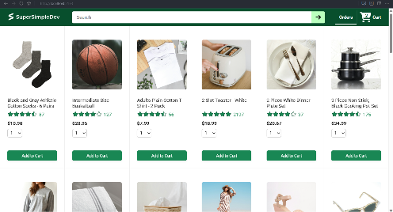
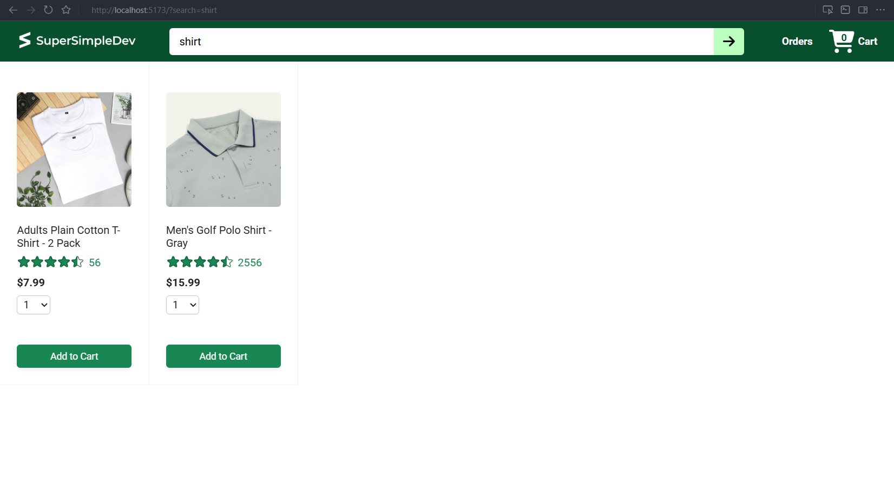
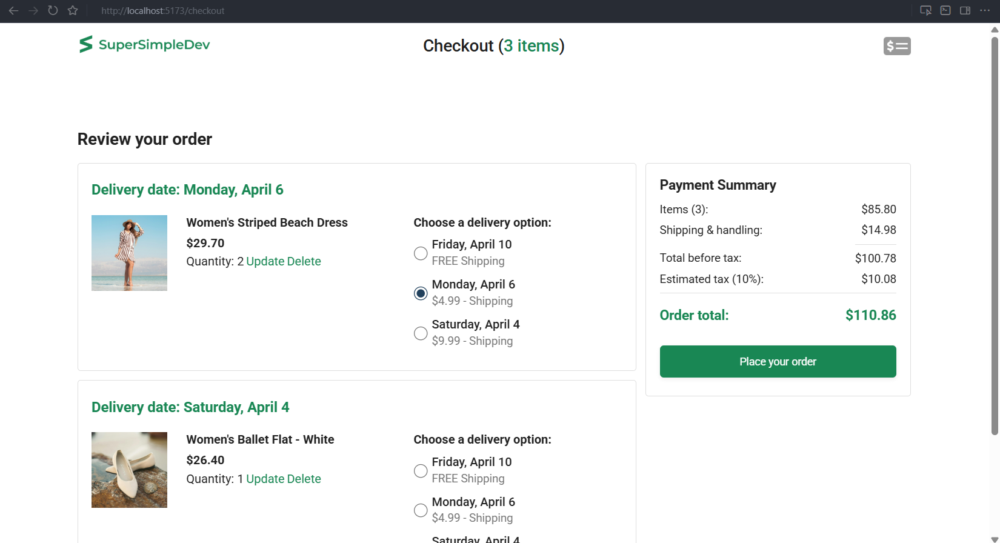
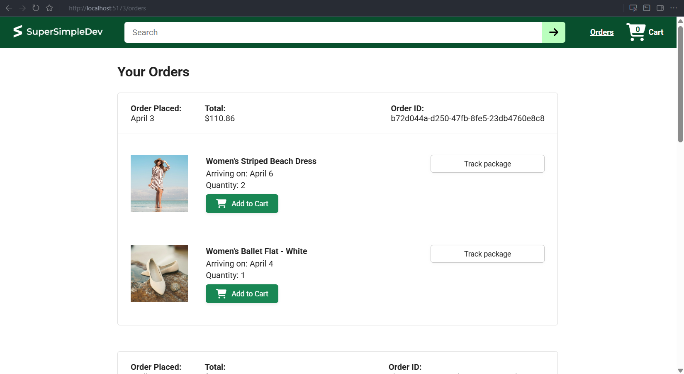
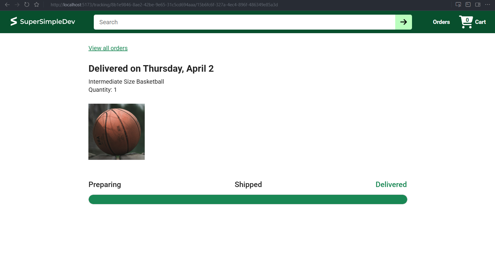

## E-commerce Frontend

This project is an **e-commerce frontend built with React**. It provides a shopping experience with product listing, cart management, checkout, order history, and order tracking.

The backend source code and API documentation are available at [e-commerce backend](https://github.com/SuperSimpleDev/ecommerce-backend-ai/tree/main).

---

## Table of Contents

- [Features](#features)
- [Screenshots](#screenshots)
  - [Home Page](#home-page)
  - [Search Results](#search-results)
  - [Checkout Page](#checkout-page)
  - [Orders Page](#orders-page)
  - [Tracking Page](#tracking-page)
- [Tech Stack](#tech-stack)
- [Project Structure](#project-structure)
- [Routing Overview](#routing-overview)
- [Backend API (Frontend Calls)](#backend-api-frontend-calls)
  - [Cart](#cart)
  - [Products](#products)
  - [Checkout](#checkout)
  - [Orders](#orders)
  - [Tracking](#tracking)
- [Local Development](#local-development)
  - [Prerequisites](#prerequisites)
  - [Install Dependencies](#install-dependencies)
  - [Run the App](#run-the-app)
  - [Available Scripts](#available-scripts)
  - [Testing](#testing)
  - [Linting & Formatting](#linting--formatting)
- [Acknowledgements](#acknowledgements)

---

## Features

- **Product browsing**: View a grid of products with images, prices, and ratings.
- **Search**: Filter products using the search bar.
- **Cart management**:
  - Add products to cart from the home page.
  - Change quantity or delete items in the checkout flow.
  - Choose delivery options per cart item.
- **Checkout**:
  - Review cart items, delivery dates, and delivery options.
  - View a full payment summary including shipping, tax, and total.
- **Orders & tracking**:
  - View past orders and their totals.
  - Track delivery progress for an individual product within an order.

All data is loaded from the backend API via `axios`, with time-related data handled using `dayjs` with timezone support.

---

## Screenshots

### Home Page



### Search Results



### Checkout Page



### Orders Page



### Tracking Page



---

## Tech Stack

- **Framework**: React (with `react-dom`)
- **Routing**: `react-router`
- **Build tool**: Vite
- **HTTP client**: `axios`
- **Dates & timezones**: `dayjs` (with `utc` and `timezone` plugins, defaulting to UTC) in `src/utils/dayjs.js`
- **Testing**: Vitest + React Testing Library (`@testing-library/react`, `@testing-library/jest-dom`, `@testing-library/user-event`)
- **Linting & formatting**: ESLint + Prettier

---

## Project Structure

Key parts of the frontend:

- `src/main.jsx`: React entry point, wraps the app in `BrowserRouter`.
- `src/App.jsx`: Top-level component that:
  - Loads the cart via `GET /api/cart-items?expand=product`.
  - Defines application routes.
- `src/components/Header.jsx`: Shared header with navigation, search, and cart quantity badge.
- `src/pages/home`:
  - `HomePage.jsx`: Loads products and renders the home view.
  - `ProductsGrid.jsx`, `Product.jsx`: Product grid and individual product card (with “Add to Cart”).
- `src/pages/checkout`:
  - `CheckoutPage.jsx`: Main checkout page layout and data loading.
  - `CheckoutHeader.jsx`, `OrderSummary.jsx`, `CartItemDetails.jsx`, `DeliveryOptions.jsx`, `DeliveryDate.jsx`, `PaymentSummary.jsx`: Checkout UI and interactions.
- `src/pages/orders`:
  - `OrdersPage.jsx`: Orders listing page.
  - `OrdersGrid.jsx`, `OrderHeader.jsx`, `OrderDetailsGrid.jsx`: Order details and “buy again” actions.
- `src/pages/TrackingPage.jsx`: Tracking view for a specific order item.
- `src/pages/NotFoundPage.jsx`: 404 page.
- `src/utils/money.js`: `formatMoney` helper for price display.
- `src/utils/dayjs.js`: Day/time configuration (UTC timezone).

Tests live alongside the components in `src/**`, using the configuration in:

- `vitest.config.js` (Vitest + React plugin)
- `setupTests.js` (sets up `@testing-library/jest-dom` and `dayjs` timezone)

---

## Routing Overview

Routing is configured in `src/main.jsx` and `src/App.jsx` using `BrowserRouter`, `Routes`, and `Route` from `react-router`.

The main routes are:

- **`/`** → `HomePage`
  - Loads products from `GET /api/products` (optionally with a `search` query).
- **`/checkout`** → `CheckoutPage`
  - Displays the cart, delivery options, and payment summary.
- **`/orders`** → `OrdersPage`
  - Shows past orders and allows “buy again”.
- **`/tracking/:orderId/:productId`** → `TrackingPage`
  - Shows order tracking for a specific product in an order.
- **Fallback (`*`)** → `NotFoundPage`

The cart is initially loaded in `App.jsx` via `GET /api/cart-items?expand=product` and is passed as a prop into each page that needs it.

---

## Backend API (Frontend Calls)

This frontend assumes the backend API is available at `/api` (proxied to `http://localhost:3000` in development via `vite.config.js`). The backend repository and full API documentation are at [e-commerce backend](https://github.com/SuperSimpleDev/ecommerce-backend-ai/tree/main).

Below are the endpoints that this frontend calls, grouped by feature area.

### Cart

Used primarily in `src/App.jsx`, `src/pages/home/Product.jsx`, `src/pages/checkout/CartItemDetails.jsx`, `src/pages/checkout/DeliveryOptions.jsx`, and `src/pages/orders/OrderDetailsGrid.jsx`:

- **Load cart**
  - `GET /api/cart-items?expand=product`
- **Add to cart**
  - `POST /api/cart-items`
    - Body includes `productId` and `quantity`.
- **Update cart item**
  - `PUT /api/cart-items/:productId`
    - Used to update:
      - `deliveryOptionId` (from `DeliveryOptions.jsx`)
      - `quantity` (from `CartItemDetails.jsx`)
- **Delete cart item**
  - `DELETE /api/cart-items/:productId`

### Products

Used in `src/pages/home/HomePage.jsx` and `src/pages/home/Product.jsx`:

- **List products**
  - `GET /api/products`
  - `GET /api/products?search=<query>`
    - The `search` query param is controlled via the header search bar and URL.
- **Add product to cart**
  - `POST /api/cart-items` (see Cart above).

### Checkout

Used in `src/pages/checkout/CheckoutPage.jsx` and its subcomponents:

- **Delivery options**
  - `GET /api/delivery-options?expand=estimatedDeliveryTime`
- **Payment summary**
  - `GET /api/payment-summary`
- **Place order**
  - `POST /api/orders`
    - Called from `PaymentSummary.jsx`, then the user is navigated to `/orders`.

### Orders

Used in `src/pages/orders/OrdersPage.jsx` and `src/pages/orders/OrderDetailsGrid.jsx`:

- **List orders**
  - `GET /api/orders?expand=products`
- **Buy again (re-add product to cart)**
  - `POST /api/cart-items` (same shape as other cart additions).

### Tracking

Used in `src/pages/TrackingPage.jsx`:

- **Order details for tracking**
  - `GET /api/orders/:orderId?expand=products`
    - The frontend finds the specific `productId` within the order and calculates delivery progress using timestamps.

---

## Local Development

### Prerequisites

- **Node.js**: v24
  - A recent LTS version is recommended.
- **Package manager**: `pnpm`
  - You can also use `npm` or `yarn` if you prefer.
- **Backend server**
  - The backend should be running on `http://localhost:3000` as described in its own README and docs.

### Install Dependencies

Using **pnpm** (recommended):

```bash
pnpm install
```

Or with **npm**:

```bash
npm install
```

### Run the App

Start the Vite development server:

```bash
pnpm dev
```

or:

```bash
npm run dev
```

By default, Vite will start on a local port (for example `http://localhost:5173`).  
API calls to `/api/*` and `/images/*` are proxied to the backend at `http://localhost:3000` as configured in `vite.config.js`.

### Available Scripts

Defined in `package.json`:

- **`pnpm dev` / `npm run dev`**: Start the Vite development server.
- **`pnpm build` / `npm run build`**: Create a production build using Vite.
- **`pnpm preview` / `npm run preview`**: Preview the production build locally.
- **`pnpm test` / `npm test`**: Run unit/integration tests with Vitest.
- **`pnpm lint` / `npm run lint`**: Run ESLint over the project.
- **`pnpm format` / `npm run format`**: Format the codebase using Prettier.

### Testing

Testing is powered by **Vitest** with **React Testing Library**:

- Configuration: `vitest.config.js`
- Test environment: `jsdom`
- Global setup: `setupTests.js`
  - Imports `@testing-library/jest-dom/vitest`
  - Ensures the `dayjs` timezone setup is applied for tests.

You can run the test suite with:

```bash
pnpm test
```

or:

```bash
npm test
```

Tests are colocated with their components in `src/**`, for example:

- `src/pages/home/HomePage.test.jsx`
- `src/pages/checkout/CheckoutPage.test.jsx`
- `src/pages/orders/OrdersPage.test.jsx`
- `src/utils/money.test.js`

### Linting & Formatting

This project uses **ESLint** and **Prettier**:

- ESLint configuration: `eslint.config.js`
- Key script commands:
  - `pnpm lint` / `npm run lint`
  - `pnpm format` / `npm run format`

Running these commands will help keep the codebase consistent and aligned with the existing style rules.

## Acknowledgements

This project was built by following the [React Tutorial](https://www.youtube.com/watch?v=TtPXvEcE11E) by **SuperSimpleDev**.
